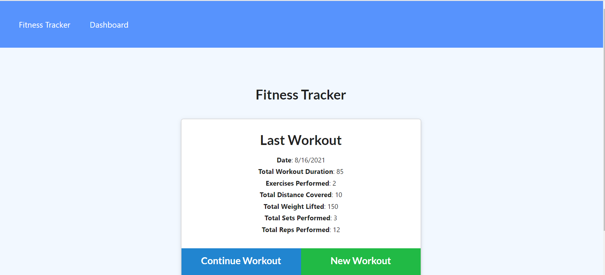
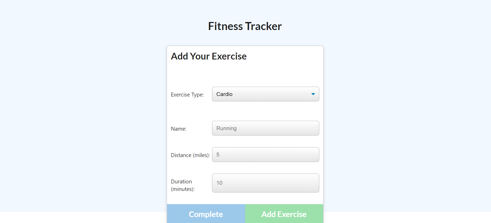
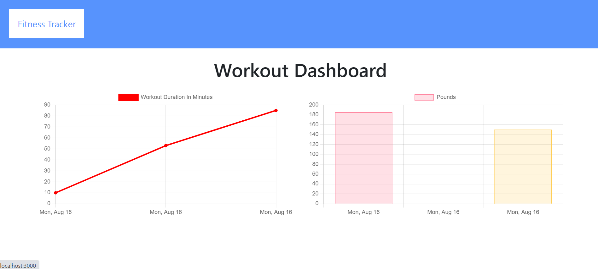

# FitnessTracker

# Description

For our week 18 assignment, we had to create an application that could track workouts and fitness goals for a user.

Name: Fitness Tracker

We were provided the front-end code for the application and our objective was to create Mongo database with a Mongoose schema and handle routes with Express.

The application will allow the user to track the name, type, weight, sets, reps, and duration of exercises; and for cardio workouts, track the distance traveled.

# Technologies Used

- HTML/CSS/Javascript
- Node.js
- Express.js
- MongoDB
- Heroku

# Links

Github URL: https://github.com/trevorwiegand92/FitnessTracker

Heroku URL: https://git.heroku.com/infinite-mesa-44173.git

# Screenshots

### Here's a screenshot of the finished home page page.

### Here's a screenshot of the finished new workout page.

### Here's a screenshot of the finished dashboard page.

